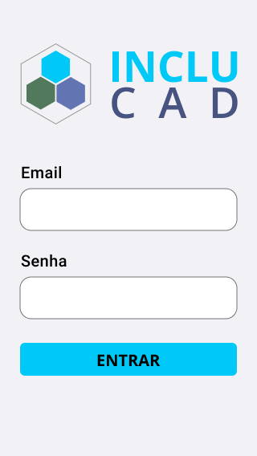
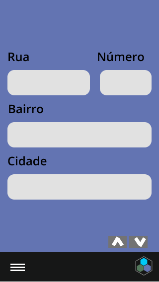

#  INCLUCAD
 [Screen Record](https://youtu.be/oq19Sse_wmM)


# **Descrição do Projeto**

O INCLUCAD é uma aplicação com o intuito de armazenar, analisar e e disponibilizar uma visualização intuitiva desses dados após o processamento. O aplicativo tem como objetivo classificar o grau de funcionalidade dessas pessoas por meio da Classificação Internacional de Funcionalidade (CIF). Os agentes farão o cadastro da pessoa com deficiência que por sua vez será avaliada posteriormente por um fisioterapeuta. Estatísticas georeferenciadas serão disponibilizadas publicamente, como uma espécie de portal da transparência de acessibilidade.

# Justificativa do Projeto

Atualmente no Brasil existe uma discrepância entre os dados do ESUS e do censo de 2010. Em Recife, por exemplo, o censo indica 400 mil pessoas com deficiência e o ESUS da atenção básica de saúde, indica apenas 22mil. 

Esse fato faz com que as pessoas com deficiências sejam invisibilidades, impedindo que a gestão desenvolva soluções voltadas para a melhoria de vida dessas. Por isso o INCLUCAD surge como uma solução para promover, em condições de igualdade, o exercício dos direitos e das liberdades fundamentais por pessoa com deficiência, visando à sua inclusão social e cidadania. 

# Cenário

- Cadastro, avaliação e visualização de dados georeferenciados de pessoas com deficiência.

# Ambiente

- Remoto
- Google Meet para reuniões diárias e semanais
- Trello para controle das atividades

# Grupos

- Pessoas que possuem algum tipo de deficiência e não estão com os dados atualizados no DataSUS e eSUS.
- Prefeituras que precisam dos dados para promover o exercício dos direitos e das liberdades fundamentais das pessoas com deficiência, para cumprir o que determina a [Lei Nº 13.146, de 6 de julho de 2015.](http://www.planalto.gov.br/ccivil_03/_ato2015-2018/2015/lei/l13146.htm)

# Personas


> Karol Pessoa, 34

**Karol** é autônoma tem 34 anos e mora em Paulista, é casada e não possui filhos. Ela possui deficiência física e precisa de cadeiras de rodas para locomoção. 

Karol é uma mulher muito comunicativa, além de sincera e objetiva, o que a ajuda nas suas lutas diárias por melhorias para as pessoas que possuem deficiência física.

Ela acredita que a prefeitura poderia desenvolver mais soluções voltadas para acessibilidade dela, pois considera despadronização das calçadas e a falta de rampas uma barreira para o exercício da sua liberdade de ir e vir.


> Joana Macaral, 57

**Joana** é gestora da cidade de Paulista. Ela acredita que a cidade precisa melhorar na assistência às pessoas com deficiência.

Joana considera que os dados os quais tem acesso atualmente são desconexos, pois verificou haver uma discrepância entre duas bases de dados. 

Por esse motivo acredita que aqueles não dão apoio as decisões para aumentar o nível de acessibilidade do município que ela administra e julga esse fato como prejudicial ao desenvolvimento de emendas relacionadas as pautas de pessoas com deficiências. 

# Validação

A validação do projeto foi feita por meio de formulários e entrevistas com usuários e stakeholders.
Para construção do [formulário](https://docs.google.com/forms/d/e/1FAIpQLSekceFHq3mB1K4rSEMhu8Qlz8AtzQML_QM4FtX5Kz3Z1JDFMg/viewform) de especificação do projeto utilizamos a [Matriz de Dúvida, Certeza e Suposição](https://medium.com/educa%C3%A7%C3%A3o-fora-da-caixa/matriz-certezas-suposi%C3%A7%C3%B5es-e-d%C3%BAvidas-fa2263633655), a qual utiliza-se de técnicas de inicialização de projeto para a construção de hipóteses e validação de ideias. Como resultado obtivemos as necessidades iniciais do projeto, ideias, atores, funcionalidades.

Para as entrevistas planejávamos usar técnicas do [Design Etnográfico Digital,](https://www.mjvinnovation.com/pt-br/blog/etnografia-digital-tecnica-de-pesquisa-qualitativa-avalia-usuario-no-ambiente-online/#:~:text=%E2%80%93%20Etnografia%20digital%3A%20Explorar%20e%20expandir,digitais%2C%20postando%20o%20material%20coletado.) mas o contexto da pandemia do corona vírus nos impediu. Então optamos por fazer as entrevistas pelo whatsapp (através de áudios) e por forms (Google Forms).

# Prototipagem

A prototipação é uma das fases mais importantes do processo de desenvolvimento de uma aplicação pois nela tem-se o primeiro contato com o que pode vir a ser a solução. Ela também abre espaço para discussões sobre as funcionalidades, aparência, experiência.

Durante o desenvolvimento da UI do projeto INCLUCAD, o nosso foco foi garantir que as interfaces estavam de acordo com as boas práticas de acessibilidade definidas pela Apple por meio do [Human Interface Guidelines](https://developer.apple.com/design/human-interface-guidelines/accessibility/overview/introduction/). 

Após analisar as respostas do formulário de expectativas do stakeholders para com o projeto, chegamos as telas do INCLUCAD que foram validadas na reunião seguinte. Nessa reunião os feedbacks foram positivos e nenhuma alteração foi solicitada.

## Telas



> Login


> Inicio


> Gráfico de mapa


> Formulário de cadastro (input)


> Tela de edição

.png)

> Gráfico de teia


> Formulário de cadastro (select)

.png)

> Gráfico barra



> Formulário de cadastro (vários campos)

# Desenvolvimento
Optamos por usar o Docker para evitar problemas de incompatibilidade futuros.

Durante o desenvolvimento, foi necessário que tomássemos a decisão de trocar o tipo de banco de dados, de SQL para NOSQL. No projeto inicial, nós usaríamos o PostgreSQL, mas, para a solução que planejávamos desenvolver, o MongoDB se mostrou mais adequado. Isso porque precisávamos de agilidade no desenvolvimento, capacidade de escabilidade e possibilidade de mudança no modelo do banco de dados.

Durante o desenvolvimento nós decidimos trocar a stack utilizada para fazer o backend. A princípio iriamos usar o laravel, mas depois de analisar as necessidades do projeto, optamos por Ruby on Rails. A decisão foi tomada porque tínhamos pouco tempo para o desenvolvimento da solução e Ruby on Rails é baseado em "convention over configuration", o que automatiza algumas estruturas e padrões de códigos, caso você siga a convenção do framework.

### Melhorias Futuras

**Criptografia**

Durante o desenvolvimento do projeto, ficou evidente a necessidade da criptografia dos dados que estaríamos utilizando, para que estivéssemos de acordo com a Lei Geral de Proteção de Dados (LGPD). Sugestões de bibliotecas (gems) para a criptografia dos dados em ruby.

- [lockbox](https://github.com/ankane/lockbox)
- [attr_encrypted](https://github.com/attr-encrypted/attr_encrypted)
- [blind_index](https://github.com/ankane/blind_index)

**Checklist de segurança**

- [Rails Security Checklist](https://github.com/eliotsykes/rails-security-checklist)

**Cookies**

Implementamos a autenticação com o uso do JSON Web Token (JWK), com a biblioteca [devise_token_auth](https://github.com/lynndylanhurley/devise_token_auth). Como melhorias futuras para aumentar a segurança do projeto, a autenticação via sessions cookies deve ser implementada

- [Using Rails Session Cookies for API Authentication](https://pragmaticstudio.com/tutorials/rails-session-cookies-for-api-authentication)

# Tech Stack

### Backend

- Ruby On Rails
- MongoDB
- Docker

### Frontend

- React.js

# **Libs usadas**

### Backend

- pry-byebug
- pry-rails
- massa
- mongoid
- mongoid-locker
- rdoc
- devise
- devise_token_auth
- rack-cors

### Frontend

- [axios](https://github.com/axios/axios)
- nivo/charts
- react-router-dom
- react-hook-form
- react-typeform
- styled-components

# Rodando o projeto localmente

```bash
git clone [https://github.com/ddevdan/INCLUCAD](https://github.com/ddevdan/INCLUCAD)
cd inclucad
```

## Backend

```bash
docker-compose up -d
```

## Frontend

```bash
cd frontend
yarn
yarn start
```

# Final Considerations

O app ainda não está em sua versão final, mas algumas funcionalidades já funcional perfeitamente.


- Links úteis

    [https://github.com/IF977/if977/blob/master/pages/projeto.md](https://github.com/IF977/if977/blob/master/pages/projeto.md)

- Referências

    [https://www.color-blindness.com/coblis-color-blindness-simulator/](https://www.color-blindness.com/coblis-color-blindness-simulator/)

     [http://www.planalto.gov.br/ccivil_03/_ato2015-2018/2015/lei/l13146.htm](http://www.planalto.gov.br/ccivil_03/_ato2015-2018/2015/lei/l13146.htm)

    [https://medium.com/educação-fora-da-caixa/matriz-certezas-suposições-e-dúvidas-fa2263633655](https://medium.com/educa%C3%A7%C3%A3o-fora-da-caixa/matriz-certezas-suposi%C3%A7%C3%B5es-e-d%C3%BAvidas-fa2263633655)

    [https://www.mjvinnovation.com/pt-br/blog/etnografia-digital-tecnica-de-pesquisa-qualitativa-avalia-usuario-no-ambiente-online/#:~:text=– Etnografia digital%3A Explorar e expandir,digitais%2C postando o material coletado](https://www.mjvinnovation.com/pt-br/blog/etnografia-digital-tecnica-de-pesquisa-qualitativa-avalia-usuario-no-ambiente-online/#:~:text=%E2%80%93%20Etnografia%20digital%3A%20Explorar%20e%20expandir,digitais%2C%20postando%20o%20material%20coletado).

    [https://developer.apple.com/design/human-interface-guidelines/accessibility/overview/introduction/](https://developer.apple.com/design/human-interface-guidelines/accessibility/overview/introduction/)
